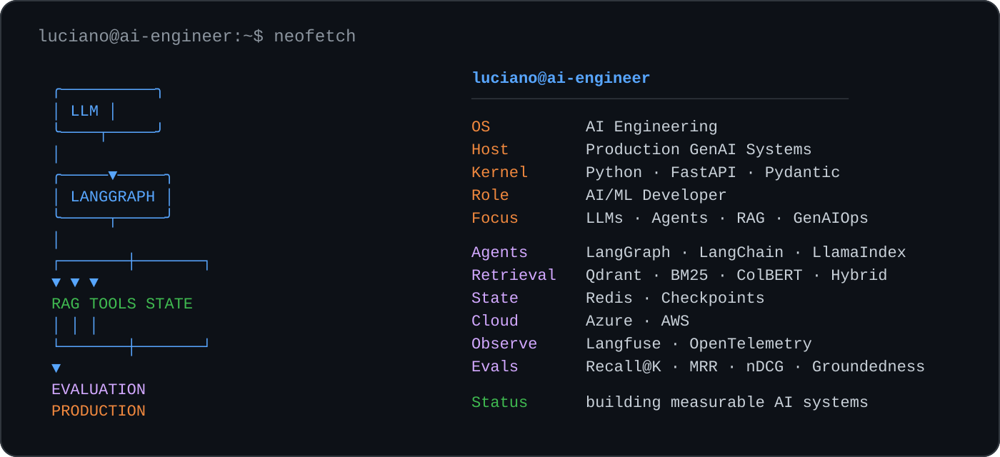

<div align="center">



**AI/ML Developer · GenAI Engineer · Agentic Systems**

`LLMs` · `AI Agents` · `RAG` · `Evals` · `Observability` · `GenAIOps`

[English version](README.en.md)

</div>

## Sobre

Construo aplicações de LLM e agentes de IA que possam ser **avaliadas, observadas e operadas com segurança em produção**.

Meu foco está na camada de engenharia entre um protótipo com LLM e um sistema confiável: recuperação, estado, ferramentas, outputs estruturados, guardrails, observabilidade, avaliação e resiliência.

> **Sistema de IA que não pode ser medido não deve ser tratado como confiável em produção.**

## Projetos em destaque

### [Forgehand](https://github.com/lucianoon/forgehand) — engenharia de agentes

Plataforma multiagente para entrega de software com fan-out paralelo, execução durável, gates humanos e judge LLM subordinado a verificações objetivas como `pytest`, `ruff` e `mypy`.

- **Operação:** circuit breakers de custo, tempo e tentativas; tracing com OpenTelemetry/Langfuse
- **Confiabilidade:** checkpoints em PostgreSQL e retomada após interrupções
- **Evidência:** [piloto reproduzível com metodologia e limitações](https://github.com/lucianoon/forgehand/blob/main/docs/pilot-report-2026-07-20.md)

### [Enterprise RAG System](https://github.com/lucianoon/enterprise-rag-system) — retrieval mensurável

Pipeline de RAG com busca híbrida, reranking e métricas por estágio para separar falhas de retrieval de falhas de geração.

- **Retrieval:** embeddings + BM25 + reranking
- **Avaliação:** Recall@K, MRR, nDCG e groundedness
- **API:** [documentação interativa](https://enterprise-rag-demo.onrender.com/docs)

### [mcp-dados-br](https://github.com/lucianoon/mcp-dados-br) — ferramentas para agentes

Servidor MCP para consultar dados públicos brasileiros a partir de agentes e assistentes de IA.

- **Fontes:** IBGE, Banco Central, INMET, Câmara dos Deputados e Senado Federal
- **Engenharia:** cache, retry, transporte stdio/HTTP, testes offline e Docker
- **Distribuição:** `uvx mcp-dados-br`

## Engenharia de produção

```text
Retrieval      → medir Recall@K, MRR e nDCG
Agent state    → controlar estado e checkpoints
LLM output     → validar outputs estruturados
Tools          → timeout, retry e idempotência
Observability  → traces, custo, latência e falhas
Evaluation     → groundedness + LLM-as-a-Judge
Deployment     → API, containers, CI/CD e cloud
```

## Stack principal

```text
Language       Python · SQL
Backend        FastAPI · Pydantic
Agents         LangGraph · LangChain · LlamaIndex
Retrieval      Qdrant · BM25 · ColBERT · SentenceTransformers
State/Data     Redis · PostgreSQL · SQLAlchemy
Cloud          Azure · AWS · Azure AI Foundry · Amazon Bedrock
Infra          Docker · Kubernetes · Terraform · CI/CD
Observability  Langfuse · OpenTelemetry · Prometheus · Grafana
```

## Princípios

```python
engineering = {
    "retrieval": "measure it",
    "state": "control it",
    "output": "validate it",
    "production": "observe it",
    "failure": "design for it",
}
```

<div align="center">

**Building AI systems that can be measured before they are trusted.**

[LinkedIn](https://www.linkedin.com/in/luciano-oliveira-nunes/) · [GitHub](https://github.com/lucianoon)

</div>
